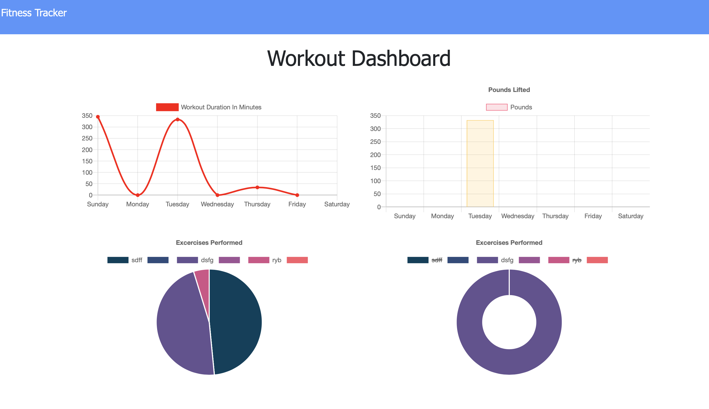

## Fitness Tracker Application

* Users are able to view create and track daily workouts, log multiple exercises in a workout on a given day, track the name, type, weight, sets, reps, and duration of exercise. Users can also track cardio exercises and distance traveled.

When the user loads the page, they are given the option to create a new workout or continue with their last workout.

The user is able to:

  * Add exercises to a previous workout plan.

  * Add new exercises to a new workout plan.

  * View the combined weight of multiple exercises on the `stats` page.
  
  * View the statistics of their workouts in graph form.

Mongoose Database and Mongoose Schema

This App is deployed on Heroku

https://fitnesstrackeripan.herokuapp.com/
